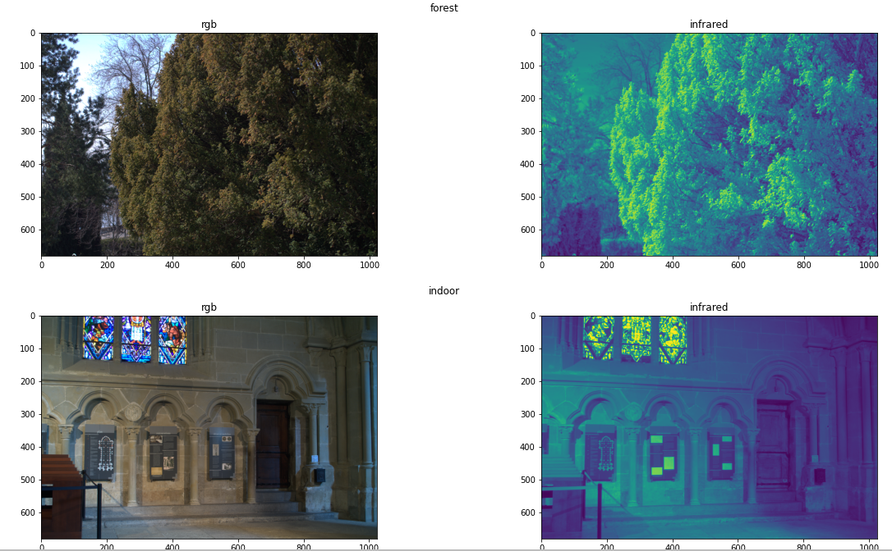

# RGB-NIR Scene Dataset


RGB-NIR Scene Dataset consist of 477 pairs of RGB+NIR images of 9 different classes. 





## How to download the dataset

Dataset can be downloaded from [EPFL website](https://www.epfl.ch/labs/ivrl/research/downloads/rgb-nir-scene-dataset/)

you can get it by running:

```
wget hhttp://ivrlwww.epfl.ch/supplementary_material/cvpr11/nirscene1.zip
```
and then unzip it using

```
unzip nirscene1.zip
```

and copy everything from `nirscene1`folder to here

You can do that by running:

```
rsync -a nirscene1 user/home/RGB-Infrared-Semgmenation/data/EPFL-thermal-images
```

If you don't want to move it to this dir, it is still fine but in next step you will have to give a path to `Indoor_dataset` dir


## What to do after you download it

Run 

```bash
python generate_data_paths_dataframe.py path/to/EPFL-dataset/root/dir"
```

if you saved it as described in [What to do after you download it](#what-to-do-after-you-download-it) you can run it with default settings

```bash
python generate_data_paths_dataframe.py 
```

it save `train.json` and `val.json` files in [app/EPFL-thermal-images/](../../app/EPFL-thermal-images/) directory

After generation you should see something like that in your terminal

```
Saved train dataset in home/user/RGB-Infrared-Classification/app/EPFL-thermal-images/train.json with 381 annotations

Saved val dataset in home/user/RGB-Infrared-Classification/app/IVRG_RGBNIR_Dataset/val.json with 96 annotations
```


