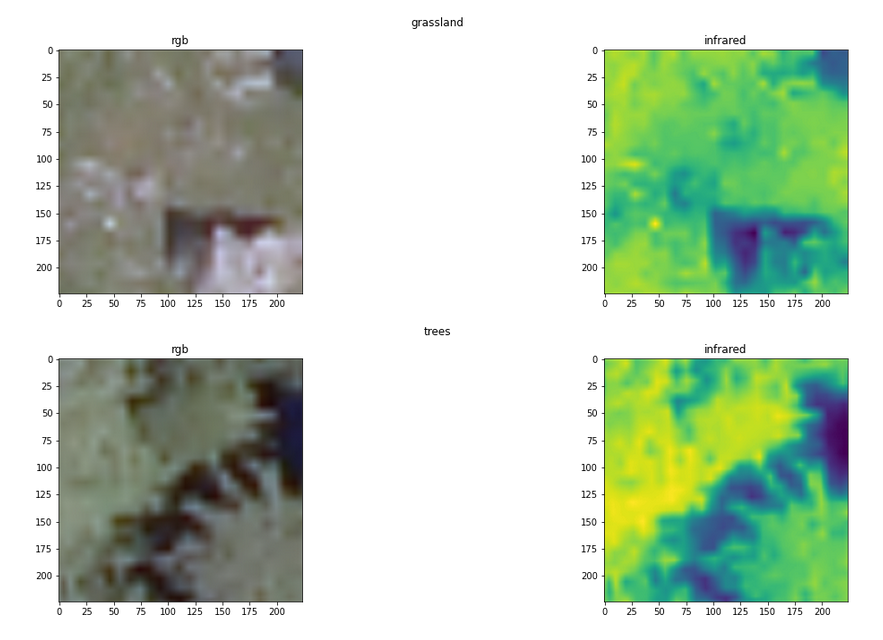

# RGB-NIR Scene Dataset


SAT 4 Dataset consist of 500 000 pairs of RGB+NIR images of 4 different classes. 





## How to download the dataset

Dataset can be downloaded from [Louisiana State University](https://csc.lsu.edu/~saikat/deepsat/)

you can get it by running:

```
gdown https://drive.google.com/uc?id=0B0Fef71_vt3PUkZ4YVZ5WWNvZWs
```
and then extract it using

```
tar -zxvf SAT-4_and_SAT-6_datasets.tar.gz
```

and copy everything from `SAT-4_and_SAT-6_datasets`folder to here

You can do that by running:

```
rsync -a SAT-4_and_SAT-6_datasets user/home/RGB-Infrared-Semgmenation/data/SAT_4-images
```

If you don't want to move it to this dir, it is still fine but in next step you will have to give a path to `SAT_4` dir


## What to do after you download it

Run 

```bash
python generate_data_paths_dataframe.py path/to/EPFL-dataset/root/dir" 
```

if you saved it as described in [What to do after you download it](#what-to-do-after-you-download-it) you can run it with default settings

```bash
python generate_data_paths_dataframe.py 
```

it save `train.json` and `val.json` files in [app/EPFL-thermal-images/](../../app/EPFL-thermal-images/) directory

After generation you should see something like that in your terminal

```
Saved train dataset in home/user/RGB-Infrared-Classification/app/SAT4/train.json with 400 00 annotations

Saved val dataset in home/user/RGB-Infrared-Classification/app/SAT4/val.json with 100 000 annotations
```


